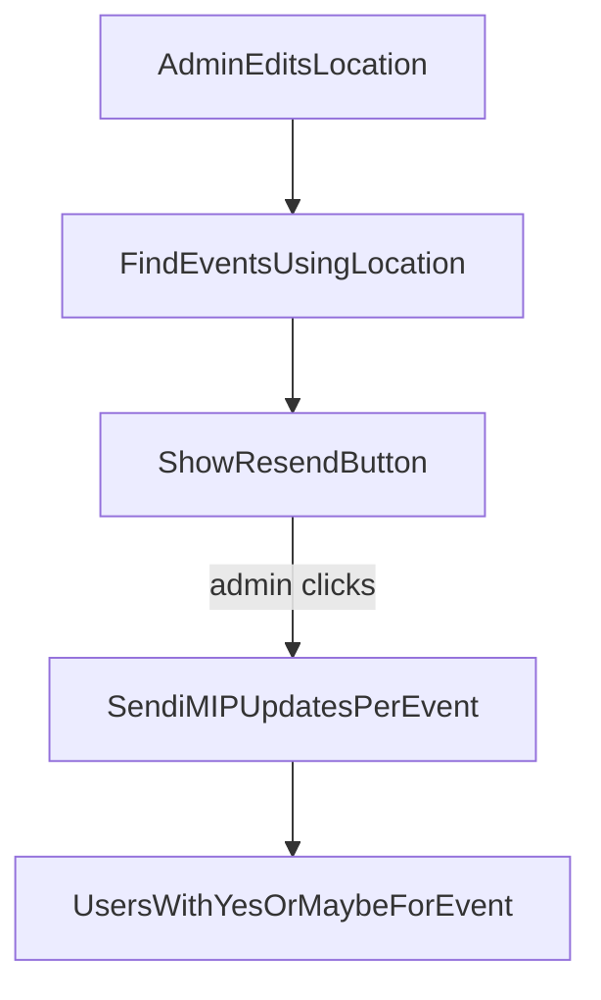

# Availability App — v2 Plan

## Goal

Update the Availability app so friends log in with **email only** (no password), receive **proper calendar invites** on demand, and each event references a **reusable location** (venue + address) for maps/directions in calendar apps.

**Repo:** [https://github.com/jodha/availability](https://github.com/jodha/availability)

## Interview decisions (locked in)

| Topic                     | Decision                                                                                         |
| ------------------------- | ------------------------------------------------------------------------------------------------ |
| Login                     | **Email whitelist** — no password; enter email, app checks allowed list                          |
| Allowed emails            | `**allowed_emails.txt`** + **admin UI** to add/remove                                            |
| First visit               | Email verified → pick **display name once** → future logins email-only                           |
| Old auth                  | **Remove entirely** — passwords, invite code, signup, forgot-password                            |
| Calendar trigger          | **On demand** — user clicks button                                                               |
| Calendar format           | **iMIP `METHOD:REQUEST`** — Add to calendar / Accept buttons                                     |
| Calendar delivery         | **One email per event**                                                                          |
| Location on events        | **Venue name + address** in calendar invite                                                      |
| Location entry            | **Separate global location catalog** — add once, pick from dropdown when adding each event       |
| Location scope            | **Global** — same locations reused across all polls                                              |
| Inline location           | **Yes** — Add Event form has "+ New location" to create venue + address without leaving page     |
| Location edit/delete      | **Always allowed** — edits apply to all events using that location                               |
| Resend on location change | **Admin action** — resend calendar invites only for events whose location changed                |
| Resend recipients         | **Yes + Maybe only** — per affected event, only users who marked Yes or Maybe receive the update |

## Location catalog

Locations repeat across events (e.g. same tennis courts). Instead of typing venue + address for every event:

- Admin manages a **global Location** list (venue name + address) — reused across all polls
- When creating an event, admin **selects a location** from a dropdown (or adds inline)
- **Edit/delete locations anytime** — all linked events pick up the new venue/address
- When a location is edited, admin sees **affected events** and can **Resend calendar invites** for those events only
- Calendar `LOCATION` field: `{venue_name}, {address}` from the linked Location
- Updated iMIP invites use `SEQUENCE` increment so calendar apps treat resends as updates

## What changes from v1

### Removed

- Password auth, invite code, signup, forgot-password
- Free-text `location` field on each event
- Plain `.ics` attachment emails

### Added

- `AllowedEmail` model + `allowed_emails.txt`
- `Location` model (venue_name, address) — reusable catalog
- Event → Location foreign key (dropdown on create event)
- iMIP calendar invites, one email per Yes/Maybe event
- Admin resend calendar invites when location changes (Yes/Maybe recipients only)

## Implementation plan

### 1. Email whitelist auth

*(unchanged — see prior sections)*

### 2. Location catalog

**Files:**

- [app/models.py](app/models.py) — `Location` model; Event links via `location_id`
- New `app/services/location_service.py` — CRUD for locations
- [app/routers/admin_routes.py](app/routers/admin_routes.py) — manage locations + pick on event create
- [app/templates/admin_dashboard.html](app/templates/admin_dashboard.html) — Locations section + dropdown on Add Event

**Admin workflow:**

1. Add locations (venue + address) in a **Locations** section
2. Create poll
3. Add events — choose **title, start time, location (dropdown)** or **+ New location** inline

### 3. Location change → resend calendar invites

When admin saves a location edit:

1. App finds all **events** linked to that location
2. Admin dashboard shows: "Location changed — affects N events" with **Resend calendar invites** button
3. On click, send updated iMIP invites (`SEQUENCE` incremented) — **one email per affected event per recipient**
4. Only users who marked **Yes or Maybe** for that event receive the resend

**Files:**

- [app/services/location_service.py](app/services/location_service.py) — detect edit, list affected events
- [app/services/calendar_service.py](app/services/calendar_service.py) — `SEQUENCE` support for updates
- [app/routers/admin_routes.py](app/routers/admin_routes.py) — resend endpoint
- [app/templates/admin_dashboard.html](app/templates/admin_dashboard.html) — resend UI after location edit

### 4. iMIP calendar invites

*(unchanged — LOCATION pulled from linked Location record)*

### 5. Cleanup, tests, deploy

*(unchanged)*

## Out of scope (for now)

- Persistent Cloudflare tunnel
- VPS migration
- Automatic calendar send on Yes/Maybe

## Interview complete — ready to build

All clarifying questions answered. Say **"go ahead"** or **"execute the plan"** to implement v2 in code.